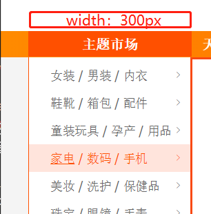

[toc]


## 前言
第一次分享总结，以css为主，对布局的总结，性能优化之类

## 概览

首先来看下css布局：


> 个人建议你们通过思维谱图建立自己的知识体系，像[百度脑图](http://naotu.baidu.com/)、[xmind](https://www.xmind.net/)之类。


## 文档流模型

### 盒模型

作为css最核心的概念，理解盒模型必不可少。


盒尺寸由4个盒子组成，分别是content box, padding box, border box, margin box。这个和盒模型中的几个盒子其实是对应的。


为什么要说到这个呢？那就要看width属性?
一般而言，width的总长度如下面公式：

```
totalWidth = margin-width * 2 + border-width * 2 + padding *2 + content-width
```
但是在万恶的IE6下，这个确实行不通的。应该为下面的公式

```
totalWidth = content-width
```

然而下面反而是更符合我们的思维的。why？举个例子。


我们从设计稿知道这个导航栏需要300px;我们很容易直接设外部的`div`的width为300,但是要保持“列表文字”与左边边距保持空隙，我们习惯性的再增加`padding-left:20px`，但是这时候你会发现这个nav的长度增加了，没错，因为这里运用的第一条公式。如果跟width是代表总长度的话，那么添加`padding`就不会使nav长度超过300px;解决办法就是使用`border-sizing: border-box`,就可以达到IE的效果

```
*, *:before, *:after {
  -moz-box-sizing: border-box; 
  -webkit-box-sizing: border-box;
  box-sizing: border-box; // 默认值为content-box
}
```

`注意:` 这里的说下兼容性问题：IE8以上，bootsrap4的源码全局设定box-sizing:border-box,来确保由于填充或边框不超出声明的元素宽度。个人觉得移动页面不考虑兼容性的话直接使用。


## 层模型

这里主要是`position`属性，5个属性值：relative 、absolute、fixed、sticky、static(默认)

### absolute中float无效

如果一个元素是浮动左或右，而且我们将此定位类型设置为 ‘absolute’ 或者 ‘fixed’ ，那么float的属性就会被设置为 ‘none’ .另一方面，如果我们将定位类型设置成relative，那么元素依然包含浮动的属性。

### absolute中内联元素表现块级元素

### absolute中外边距合并现象无效

## float

简单理解就是word的`文字环绕图片效果`。建议看下：

[CSS float浮动的深入研究、详解及拓展(一)](https://www.zhangxinxu.com/wordpress/2010/01/css-float%E6%B5%AE%E5%8A%A8%E7%9A%84%E6%B7%B1%E5%85%A5%E7%A0%94%E7%A9%B6%E3%80%81%E8%AF%A6%E8%A7%A3%E5%8F%8A%E6%8B%93%E5%B1%95%E4%B8%80/)
[CSS float浮动的深入研究、详解及拓展(二)](https://www.zhangxinxu.com/wordpress/2010/01/css-float浮动的深入研究、详解及拓展二/)

## 额外：BFC

> 块格式化上下文（Block Formatting Context，BFC） 是Web页面的可视化CSS渲染的一部分，是布局过程中生成块级盒子的区域，也是浮动元素与其他元素的交互限定区域。


### 创建一个BFC

* [产生BFC <del>自己看文档吧，太懒了不搬</del>](https://developer.mozilla.org/zh-CN/docs/Web/Guide/CSS/Block_formatting_context)


## `min-height`的坑
之前遇到过的，再用栅格系统多列布局时，使用ajax加载页面数据失败导致某一列没有高度，页面混乱,这时候min-height就派上用场！


### 参考连接

* [理解CSS中BFC](https://www.w3cplus.com/css/understanding-block-formatting-contexts-in-css.html)
* 《css权威指南》


